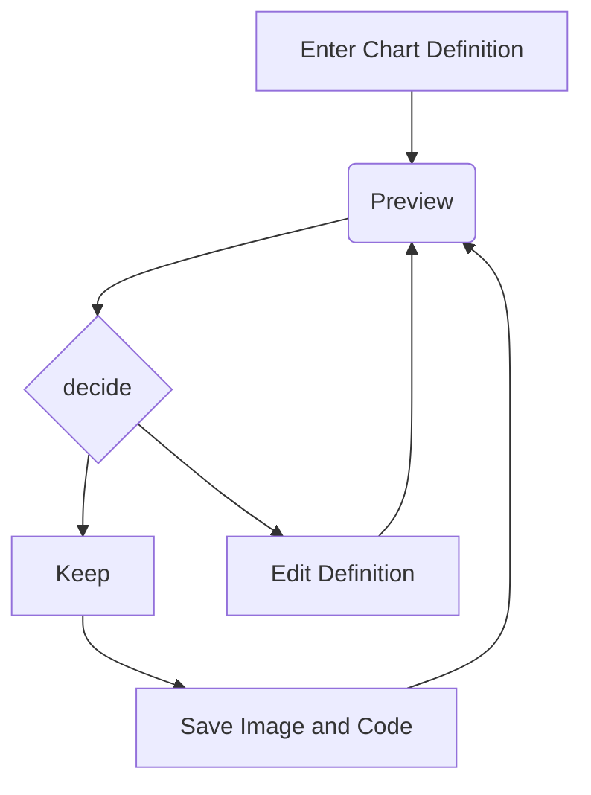

> 本文章为测试显示是否正常使用
<!-- more -->

公式块测试:

$$
y = ax + b
$$

行级公式测试: $y = kx$

---

代码块测试:

```cpp
#include <iostream>
int main()
{
  return 0;
}
```

行级代码测试: `#include`

---

mermaid测试:



---

表格测试:

| 1   | 2   |
| --- | --- |
| 3   | 4   |
|     |     |

图片测试:


上述的图片相对路径效果可以如下设置:


如果希望批量重命名, 可以使用插件实现, 具体设置:


